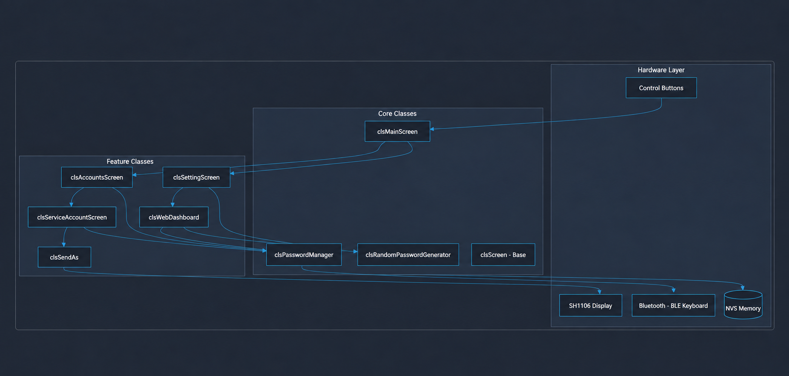
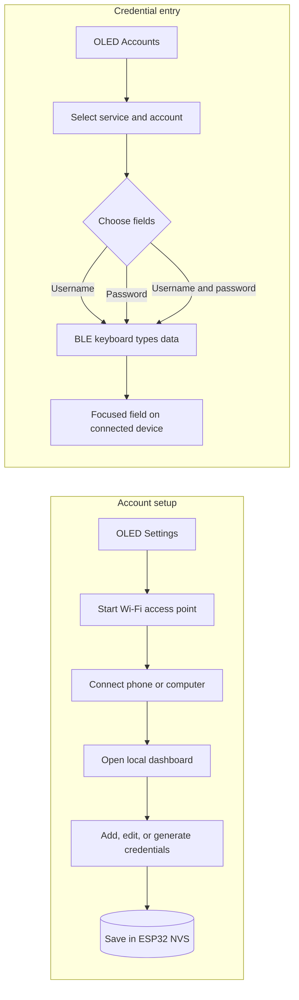
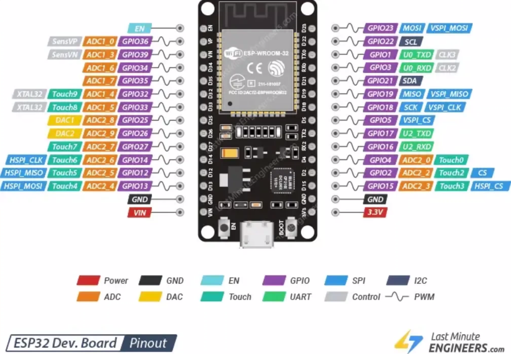

# PassKeeper ESP 🔐


**PassKeeper ESP** (formerly Mr.PassKeeper) is a local hardware password manager powered by the **ESP32** microcontroller. It combines an OLED display, BLE (Bluetooth Low Energy) keyboard emulation, and a Wi-Fi access point with a local web dashboard. Credentials are managed on the device without a cloud service.

The device can generate, store, and type credentials into a BLE-connected host. **Important:** credentials are currently stored as plain text in ESP32 NVS Preferences; the current implementation does not encrypt them. Avoid describing this prototype as an encrypted or air-gapped vault.

## Quick Navigation

- [Overview and architecture](#system-overview--architecture)
- [Getting started](#-getting-started-walkthrough)
- [Hardware and pinout](#️-hardware-components)
- [Development setup](#-development-prerequisites)
- [Security note](#security-note)
- [Project files](#project-files)

<p align="center">
    <a href="2.png"></a>
</p>
<p align="center"><em>System architecture: buttons, screens, account management, BLE keyboard, and NVS storage.</em></p>

---

## 🎓 Academic Project Details

This project was developed as a university project at **Alrazi University** (Summer 2026).

**Team Members:**

- Mohammed Fouad Mohammed Al-Yousefi (138)
- Ezzedin Mueen Mohammed Aqeel (103)
- Muneer Abdullah Hamoud Ahmed Al-Najm (140)
- Mohammed Abdo Mohammed Haj Muhaim (132)
- Hadi Abdullah Nasser Saleh Futaih (149)

**Instructors:**

- Dr. Mahmoud E. Hodeish
- Eng. Majd Alsurihi

---

## 🎯 Project Objectives

1. **Physical Security (Air-Gapped):** Develop an ESP32-based hardware password manager isolated from OS vulnerabilities (like malware and keyloggers).
2. **Cloud Independence:** Zero reliance on cloud storage. All credentials are saved securely and locally in the NVS flash memory.
3. **Cross-Platform Plug-and-Play:** Emulate a Bluetooth Keyboard for seamless cross-platform typing without requiring external software.
4. **Intuitive Local Web Dashboard:** Implement an easy-to-use local Web Dashboard (Captive Portal) for adding and managing credentials.
5. **Hardware RNG:** Provide a hardware-based Random Password Generator.
6. **Physical UI Navigation:** Display a UI on a 1.3" OLED screen using physical push-button navigation.

---

## 🏗️ System Overview & Architecture

PassKeeper ESP operates as a self-contained vault managed by the ESP32 CPU.

### High-Level Description

- **Configuration Mode:** When interacting with the web server via the ESP32's Wi-Fi Access Point, users can add, edit, or generate accounts.
- **Injection Mode:** For usage, the user navigates the OLED UI using physical buttons to select an account, which triggers the BLE module to send the saved credentials as emulated keystrokes to the connected host device.

### Functional Flow

- **Sensing / Input:** 3 Hardware push buttons trigger UI navigation and injection events.
- **Processing:** C++ OOP logic manages data, interfaces with the OLED, and controls Wi-Fi/BLE stacks. Data is saved in NVS memory.
- **Visualization:** An I2C-enabled SH1106 1.3" OLED provides a user-friendly interface.
- **Alerting / Output:** BLE Keyboard emulator sends automated keystrokes.



```mermaid
graph TD
    subgraph Hardware Layer
        BTN[Push Buttons]
        OLED[1.3" OLED SH1106]
        BLE[Bluetooth - BLE Keyboard]
        FLASH[(Internal NVS Flash)]
    end

    subgraph Core Classes
        PM[clsPasswordManager]
        RNG[clsRandomPasswordGenerator]
        MS[clsMainScreen]
        SC[clsScreen - Base]
    end

    subgraph Feature Classes
        ACC[clsAccountsScreen]
        SRV[clsServiceAccountScreen]
        SND[clsSendAs]
        SET[clsSettingScreen]
        WEB[clsWebDashboard]
    end

    %% Connections
    BTN --> MS
    MS --> ACC
    MS --> SET

    ACC --> SRV
    SRV --> SND
    SND --> BLE

    SET --> WEB
    WEB --> PM
    SRV --> PM
    ACC --> PM

    PM --> FLASH
    WEB --> RNG
    SET --> RNG
```

---

## 🚀 Getting Started (Walkthrough)

### 1️⃣ Boot and OLED Interface

- Power the ESP32 via USB (5V DC) or a battery module. Total consumption is ~150-250mA (Wi-Fi) and much lower in BLE mode.
- The welcome screen appears, followed by the main menu:
  1. `Accounts` (View saved accounts).
  2. `Settings` (Launch the web dashboard).

### 2️⃣ Adding Accounts (Web Dashboard)

1. Navigate to **Settings** on the OLED by long-pressing the green button (Confirm/Select).
2. The device will broadcast a Wi-Fi Access Point and display a **Random Password** on the screen.
3. Connect to this Wi-Fi network using your phone or PC.
4. Once connected, a Captive Portal will automatically open the **PassKeeper ESP Dashboard**.
5. Create a new service (e.g., GitHub), add your email/username and password. Use the `Regenerate` button for a secure random password.
6. Click **Save** to store credentials instantly in the ESP32 flash memory.
7. Long-press the green button on the ESP32 to stop the Wi-Fi AP and return to the main menu.

### 3️⃣ Using Your Passwords (BLE Injection)

1. Go to **Accounts** on the OLED menu.
2. Select the service you added (e.g., GitHub).
3. Select your account and choose the injection method:
   - `Username`
   - `Password`
   - `User&Pass` (Types Username -> presses 'Tab' -> types Password -> presses 'Enter').
4. Ensure your host device (PC/Phone) keyboard language is set to **English**.
5. Long-press the injection button. The ESP32 will automatically type the data flawlessly!

---

## ⚙️ Hardware Components

| Component Name  | Specification / Model  | Quantity |
| --------------- | ---------------------- | -------- |
| Microcontroller | ESP32 (DOIT DEVKIT V1) | 1        |
| Display         | 1.3" OLED SH1106 (I2C) | 1        |
| Input           | Push Buttons           | 3        |

_The ESP32 was selected for its integrated Wi-Fi and BLE capabilities, plus adequate flash memory for the Web Server. The SH1106 OLED offers a crisp interface over just two I2C pins, saving GPIO._

### ESP32 Pinout Reference

<p align="center">
    <a href="1.png"></a>
</p>
<p align="center"><em>Pinout reference for the ESP32 development board. See the <a href="https://lastminuteengineers.com/esp32-pinout-reference/">original pinout reference</a>.</em></p>

---

## 💻 Development Prerequisites

To compile and modify this project, set up **PlatformIO** with the following requirements:

1. **Board:** ESP32 (DOIT DEVKIT V1 or equivalent)
2. **Partition Scheme:** Due to the large size of Wi-Fi and BLE stacks, you must modify `platformio.ini`:
   ```ini
   board_build.partitions = huge_app.csv
   ```
3. **Required Libraries:**
   - [Adafruit SH110X](https://github.com/adafruit/Adafruit_SH110x) (Display)
   - [Adafruit GFX Library](https://github.com/adafruit/Adafruit-GFX-Library) (Graphics)
   - [ESP32 BLE Keyboard](https://github.com/T-vK/ESP32-BLE-Keyboard) (Keystroke Injection)
   - `Preferences` (Built-in for NVS)
   - `WiFi`, `WebServer`, `DNSServer` (Built-in)

For board and build configuration details, see the [PlatformIO project configuration](platformio.ini) and the [PlatformIO ESP32 documentation](https://docs.platformio.org/en/latest/platforms/espressif32.html).

---

## Security Note

- Credentials are stored as plain text strings in NVS Preferences by [`clsPasswordManager`](src/Core/clsPasswordManager.h). NVS storage alone does not mean the credentials are encrypted.
- The dashboard is served over the device's local Wi-Fi access point; it is not an internet-hosted service.
- The BLE keyboard sends selected credential characters to the currently focused field on the connected host. Check the target device and field before sending.

## Project Files

| File or folder                               | Purpose                                                  |
| -------------------------------------------- | -------------------------------------------------------- |
| [`src/main.cpp`](src/main.cpp)               | Initializes the OLED, BLE keyboard, and main screen      |
| [`src/Core/`](src/Core/)                     | Main screen, password storage, and password generator    |
| [`src/AccountClasses/`](src/AccountClasses/) | Account browsing and BLE typing options                  |
| [`src/SettingClasses/`](src/SettingClasses/) | Wi-Fi settings screen and local web dashboard            |
| [`platformio.ini`](platformio.ini)           | PlatformIO board, libraries, and partition configuration |
| [`PassKeeper.pdf`](PassKeeper.pdf)           | Project report and hardware material                     |

---

## 🛠️ Testing & Challenges

- **High-Speed Typing Drops:** Fast BLE injection caused dropped characters. _Solution:_ Implemented `bleKeyboard.setDelay(30)` to introduce a micro-pause between keystrokes.
- **Code Size Limitations:** Default partitions were too small. _Solution:_ Switched to `huge_app.csv`.
- **Keyboard Layout:** Wrong characters are typed if the host PC keyboard is Arabic. _Solution:_ Known limitation; host keyboard must be set to English.

## 🚀 Future Work

- **Security:** Biometric fingerprint sensor integration for unlocking.
- **Data Backup:** SD Card module for encrypted backups and restoration.
- **Localization:** Algorithms to support sending ALT-codes to bypass keyboard language layout limitations.

---

_Developed as an isolated, OOP-structured, and highly efficient password management prototype._
